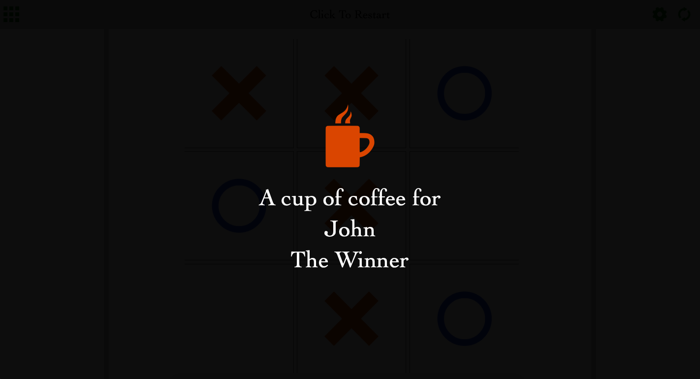

# TicTacToe-JS

<!--
*** Thanks for checking out this README Template. If you have a suggestion that would
*** make this better, please fork the repo and create a pull request or simply open
*** an issue with the tag "enhancement".
*** Thanks again! Now go create something AMAZING! :D
-->

<!-- PROJECT SHIELDS -->
<!--
*** I'm using markdown "reference style" links for readability.
*** Reference links are enclosed in brackets [ ] instead of parentheses ( ).
*** See the bottom of this document for the declaration of the reference variables
*** for contributors-url, forks-url, etc. This is an optional, concise syntax you may use.
*** https://www.markdownguide.org/basic-syntax/#reference-style-links
-->

[![Contributors][contributors-shield]][contributors-url]
[![Forks][forks-shield]][forks-url]
[![Stargazers][stars-shield]][stars-url]
[![Issues][issues-shield]][issues-url]

<!-- PROJECT LOGO -->
<br />
<p align="center">
  <a href="https://github.com/ioanniskousis/TicTacToe-JS">
    
  </a>
  
  <h3 align="center">The TicTacToe-JS Application</h3>
  
  <p align="center">
    This project is part of the Microverse curriculum in JavaScript course!
    <br />
    <a href="https://ioanniskousis.github.io/TicTacToe-JS/"><strong>Live Version</strong></a>
    <br />
    <a href="https://github.com/ioanniskousis/TicTacToe-JS"><strong>Explore the docs »</strong></a>
    <br />
    <br />
    <a href="https://github.com/ioanniskousis/TicTacToe-JS/issues">Report Bug</a>
    <a href="https://github.com/ioanniskousis/TicTacToe-JS/issues">Request Feature</a>
  </p>
</p>

The traditional table game tic-tac-toe built with HTML5, CSS3 and JavaScript

<hr />

## Application Screen Shots  


<hr />

<hr />

<hr />

<!-- TABLE OF CONTENTS -->

## Table of Contents

- [About the Project](#about-the-project)
- [Application Instructions](#application-instructions)
- [System Requierments](#system-requierments)
- [Development](#development)
- [Testing](#testing)
- [Live Version](#live-version)
- [Built With](#built-with)
- [Contributors](#contributors)
- [Acknowledgements](#acknowledgements)

<!-- ABOUT THE PROJECT -->

## About The Project  

  The project is implemented using an HTML page - the index.html. 
  Two main classes, Gameboard and Player, are used to manage game data. 

  * The Gameboard class holds an array of cells to keep track of the players' moves. The game data is persistently stored in localStorage and retrieved each time the page is loaded. It also holds pointers to its 2 players.  
  * After each player's move, it checks  
      1. if the game is over and   
      2. if there is a winner  
  In details, the cells array initially is 
  ```
  [0, 0, 0, 0, 0, 0, 0, 0, 0]. 
  ```
  * Each time a player checks a cell the particular cell takes a value of 1 or 2.  
  * For example, after player1 checks cell[3] then the array is 
  ```
  [0, 0, 0, 1, 0, 0, 0, 0, 0], 
  ```
  and if player2 checks cell[5] then the array becomes 
  ```
  [0, 0, 0, 1, 0, 2, 0, 0, 0]. 
  ```
  * When none of the items is 0 then the game is over.   
  * When there is a pattern denoting a row, column or diagonal then there is a winner.  

  Two instances of the Player class hold information about the 2 players - their *name* and the *image* for their moves which is either an *X-image* or a *Circle*. Players' info is also stored in *localStorage*. The player's info can be edited using a settings view.  
  
<hr/>

  There are 5 JavaScript files.  

    - main.js         : Initializes objects and event handlers, and applies the game logic  

    - game.js         : Implements the GameBoard class  

    - player.js       : Implements the Player class  

    - controlFlow.js  : Implements all handlers and rendering   

    - utils.js        : Helper file for shorhand commands  

<hr/>

<!-- ABOUT THE PROJECT -->

## Application Instructions  

  The game provides a grid of 3x3 cells.  
  It is played by 2 players and each player has an image - either an x-image or a circle - that tries to fill a set of 3 images in either a row or a column or a diagonal. The first player who achieves this is the winner.  
  The players decide who to play first and check the cell of their choice with their image in rotation.  

  The game ends either when there is a winner or all cells are checked.  
  When there is a winner, the other player is playing first in the next round.  
  When there is no winner, the last player is playing first.  

By clicking the restart button at the top-right the game is reset and the players are swapped. 

Initially, the 2 players are named 'Player 1' and 'Player 2'. 
Their name can be edited using the settings view which can be selected by clicking the settings button at the top-right. 
They also can select check-image and image color between blue and red. 
If the page closes before the end of the game, it is stored and can be continued at any time. 

<hr/>

## System Requierments
  - JavaScript Enabled
  - You need to Disable Cross-Origin-Restrictions from your browser, if you want to open the index.html from your file system without using a server.  

<hr/>

## Development
  * Clone the project
  ```
    https://github.com/ioanniskousis/TicTacToe-JS.git
    
    Use VSCode and Live Server to show index.html
  ``` 
<hr/>

## Testing
  ### Jest has been used to test-drive this project  

  Tests have been applied to class GameBoard held in game.js  
  All functions are pure and have a relevant test in game.test.js   

<hr/>

## Live Version

  [Tic-Tac-Toe](https://ioanniskousis.github.io/TicTacToe-JS/)

<hr/>

## Built With

This project was built using these technologies.

  - JavaScript (ES6)
  - HTML5
  - CSS3
  - Git - GitHub
  - ESLint
  - Stylelint
  - Stickler

<hr/>

<!-- CONTACT -->

## Contributors

:bust_in_silhouette:
​
## Ioannis Kousis

- Github: [@ioanniskousis](https://github.com/ioanniskousis)
- Twitter: [@ioanniskousis](https://twitter.com/ioanniskousis)
- Linkedin: [Ioannis Kousis](https://www.linkedin.com/in/jgkousis)
- E-mail: jgkousis@gmail.com
​
<hr/>
<!-- ACKNOWLEDGEMENTS -->

## Acknowledgements

  - [Microverse](https://www.microverse.org/)
  - [The Odin Project](https://www.theodinproject.com/)


<!-- MARKDOWN LINKS & IMAGES -->
<!-- https://www.markdownguide.org/basic-syntax/#reference-style-links -->

[contributors-shield]: https://img.shields.io/github/contributors/ioanniskousis/TicTacToe-JS.svg?style=flat-square
[contributors-url]: https://github.com/ioanniskousis/TicTacToe-JS/graphs/contributors
[forks-shield]: https://img.shields.io/github/forks/ioanniskousis/TicTacToe-JS.svg?style=flat-square
[forks-url]: https://github.com/ioanniskousis/TicTacToe-JS/network/members
[stars-shield]: https://img.shields.io/github/stars/ioanniskousis/TicTacToe-JS.svg?style=flat-square
[stars-url]: https://github.com/ioanniskousis/TicTacToe-JS/stargazers
[issues-shield]: https://img.shields.io/github/issues/ioanniskousis/TicTacToe-JS.svg?style=flat-square
[issues-url]: https://github.com/ioanniskousis/TicTacToe-JS/issues
